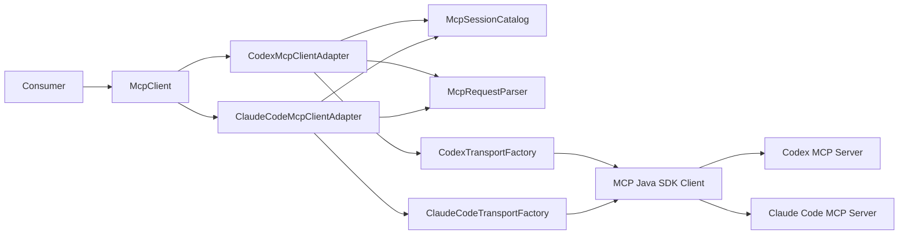

# 技術設計: mcp-client-sdk-modules-codex-client-claude-code-client

## 概要
本設計の目的は、`modules/codex-client` と `modules/claude-code-client` を、共通契約 `McpClient` で多態利用できる構造として定義することである。呼び出し側はプロバイダ実装を意識せず、`openSession` / `execute` / `closeSession` の同一インターフェースで MCP サーバ連携を実行する。

対象ユーザーは、ZAIN の上位モジュールまたは利用アプリケーションで MCP クライアントを呼び出す実装者、および契約準拠を検証する品質保証担当者である。要件上の差分（プロバイダ種別、接続失敗、セッション状態、入力境界）は `McpResult` と `McpError` の契約に吸収する。

影響範囲は、`build.sbt` のマルチモジュール化、`modules/core` の共通契約追加、`modules/codex-client` と `modules/claude-code-client` の adapter 実装追加、契約テストの導入である。既存の業務コード変更はない。

## ゴールと非ゴール
### ゴール
- `McpClient` 共通契約の確立（要件1）
- Codex/Claude Code の2実装で同一契約を満たすこと（要件2, 3, 4, 5）
- 共通契約テストの再利用可能な形での定義（要件6）

### 非ゴール
- 3つ目以降のプロバイダ実装追加
- 永続ストレージへのセッション永続化
- MCPサーバの起動管理・監視機能
- TAKT/Pekko-Stream 側の統合実装（本 feature はクライアントモジュール設計に限定）

## アーキテクチャ
### パターン
- **Port and Adapter**: `McpClient` をドメイン契約（Port）として定義し、`CodexMcpClientAdapter` / `ClaudeCodeMcpClientAdapter` で実装する。
- **マルチモジュール分離**: `core` は契約のみ、各 provider module は MCP Java SDK 依存を内包する。
- **明示的状態管理**: セッション状態は `McpSessionCatalog` で管理し、`SessionNotFound` / `SessionClosed` を契約として返す。

### 境界マップ


### 技術スタック
| レイヤー | 技術/バージョン | 役割 |
|---------|---------------|------|
| Domain Contract | Scala 3.8.1 | `McpClient` / `McpResult` / `McpResponse` / `McpError` の定義 |
| Provider Adapter | Scala 3.8.1 + MCP Java SDK | Codex/Claude Code それぞれの MCP 接続実装 |
| Transport | MCP (STDIO / Streamable-HTTP / SSE) | `openSession` 時の接続方式 |
| Testing | ScalaTest または MUnit | 契約テスト・状態遷移テスト・統合テスト |
| Build | sbt (multi-project) | `core`, `codex-client`, `claude-code-client` の依存管理 |

### 想定モジュール構成
```text
modules/
  core/
    src/main/scala/zain/core/mcp/
      McpClient.scala
      McpResult.scala
      McpError.scala
      McpResponse.scala
      McpConnectionConfig.scala
      McpTransport.scala
      McpSessionId.scala
      McpRequest.scala
      McpRequestParser.scala
      McpSessionCatalog.scala
  codex-client/
    src/main/scala/zain/mcp/codex/
      CodexMcpClientAdapter.scala
      CodexTransportFactory.scala
  claude-code-client/
    src/main/scala/zain/mcp/claude/
      ClaudeCodeMcpClientAdapter.scala
      ClaudeCodeTransportFactory.scala
  contract-tests/
    src/test/scala/zain/mcp/contract/
      McpClientContractSuite.scala
      CodexMcpClientContractSuite.scala
      ClaudeCodeMcpClientContractSuite.scala
```

## コンポーネントとインターフェース
### サマリー
| コンポーネント | ドメイン/層 | 意図 | 要件カバレッジ |
|-------------|----------|------|-------------|
| `McpClient` | Core/Domain | 共通操作契約の公開 | 1.1-1.6 |
| `McpResult` + `McpError` + `McpResponse` | Core/Domain | 成功/失敗と共通レスポンス契約の統一 | 1.4-1.6, 4.1-4.4, 5.1-5.4 |
| `McpSessionCatalog` | Core/Domain | セッション状態と識別子の整合管理 | 2.4, 3.4, 5.4 |
| `McpRequestParser` | Core/Domain | 入力境界（0文字/1文字）の一貫判定 | 5.1-5.3 |
| `CodexMcpClientAdapter` | Provider Adapter | Codex MCP を `McpClient` 契約に適合 | 2.1-2.4, 4.1 |
| `ClaudeCodeMcpClientAdapter` | Provider Adapter | Claude Code MCP を `McpClient` 契約に適合 | 3.1-3.4, 4.2 |
| `CodexTransportFactory` | Provider Adapter | Codex 用 transport/client 生成境界 | 2.1, 2.3 |
| `ClaudeCodeTransportFactory` | Provider Adapter | Claude Code 用 transport/client 生成境界 | 3.1, 3.3 |
| `McpClientContractSuite` | Test | 実装差分を隠蔽した契約テスト共通化 | 6.1, 6.2 |

### `McpClient`（共通契約）
- 責務: 呼び出し側が依存する唯一の公開操作を定義する。
- 公開インターフェース:
  - `openSession(config: McpConnectionConfig): McpResult[McpSessionId]`
  - `execute(sessionId: McpSessionId, request: McpRequest): McpResult[McpResponse]`
  - `closeSession(sessionId: McpSessionId): McpResult[Unit]`
- 境界: provider 固有の SDK 型を公開しない。

### `McpResult` / `McpError` / `McpResponse`（共通結果契約）
- 責務: 成功/失敗を例外でなく値で返し、失敗分類を統一する。
- 公開インターフェース:
  - `McpResult.Success[A](value: A)`
  - `McpResult.Failure(error: McpError)`
  - `McpError.ConnectionUnavailable`
  - `McpError.SessionClosed`
  - `McpError.SessionNotFound`
  - `McpError.InvalidRequest`
  - `McpResponse(provider: McpProvider, sessionId: McpSessionId, content: String)`
- 境界: エラー種別は公開契約で固定し、SDK個別エラーは adapter 内で正規化する。

### `McpSessionCatalog`（セッション状態管理）
- 責務: セッション識別子と状態 (`Opened` / `Closed`) の整合を保証する。
- 公開インターフェース:
  - `register(sessionId: McpSessionId, provider: McpProvider, config: McpConnectionConfig): McpSessionEntry`
  - `resolve(sessionId: McpSessionId): Option[McpSessionEntry>`
  - `markClosed(sessionId: McpSessionId): Either[McpError, Unit]`
- 境界: adapter は catalog を通じてのみ状態判定する。

### `McpRequestParser`（入力境界）
- 責務: `execute` 入力を `McpRequest` に parse し、契約上の境界条件を統一する。
- 公開インターフェース:
  - `parse(content: String): Either[McpError.InvalidRequest.type, McpRequest]`
- 判定契約:
  - 0文字 -> `InvalidRequest`
  - 1文字以上 -> 有効

### `CodexMcpClientAdapter`
- 責務: Codex MCP サーバ接続を `McpClient` 契約にマッピングする。
- 公開インターフェース: `McpClient` の3操作を実装。
- 依存:
  - `CodexTransportFactory`
  - `McpSessionCatalog`
  - `McpRequestParser`
- 返却契約:
  - 接続不可 -> `Failure(ConnectionUnavailable)`
  - 終了済みセッション execute -> `Failure(SessionClosed)`
  - 成功 execute -> `Success(McpResponse(provider=codex,...))`

### `ClaudeCodeMcpClientAdapter`
- 責務: Claude Code MCP サーバ接続を `McpClient` 契約にマッピングする。
- 公開インターフェース: `McpClient` の3操作を実装。
- 依存:
  - `ClaudeCodeTransportFactory`
  - `McpSessionCatalog`
  - `McpRequestParser`
- 返却契約:
  - 接続不可 -> `Failure(ConnectionUnavailable)`
  - 終了済みセッション execute -> `Failure(SessionClosed)`
  - 成功 execute -> `Success(McpResponse(provider=claude-code,...))`

### `CodexTransportFactory` / `ClaudeCodeTransportFactory`
- 責務: `McpConnectionConfig` から provider 用の MCP Java SDK クライアントを生成する。
- 公開インターフェース:
  - `create(config: McpConnectionConfig): Either[McpError.ConnectionUnavailable.type, ProviderClientHandle]`
- 境界: transport 実装差分（stdio/http/sse）は factory 内に閉じる。

### `McpClientContractSuite`
- 責務: `McpClient` 実装に対する共通契約テストを1セットで定義する。
- 公開インターフェース:
  - `def newClient(): McpClient`
  - `def providerName(): McpProvider`
- 派生:
  - `CodexMcpClientContractSuite`
  - `ClaudeCodeMcpClientContractSuite`

## データモデル
### ドメインモデル
| 型 | 種別 | 主要属性 | 不変条件 |
|----|------|---------|---------|
| `McpConnectionConfig` | 値オブジェクト | `serverUrl`, `transport` | `serverUrl` は空でない、`transport` は定義済み列挙のみ |
| `McpSessionId` | 値オブジェクト | `value` | 空文字禁止、セッション単位で一意 |
| `McpRequest` | 値オブジェクト | `content` | 1文字以上 |
| `McpResponse` | 値オブジェクト | `provider`, `sessionId`, `content` | `provider/sessionId/content` 全て必須 |
| `McpError` | 列挙 | `ConnectionUnavailable`, `SessionClosed`, `SessionNotFound`, `InvalidRequest` | 公開契約のエラー種別を固定 |
| `McpSessionEntry` | エンティティ | `sessionId`, `provider`, `state`, `connectionConfig` | `Closed` 後は `execute` 不可 |

### 論理データモデル
| 論理名 | 主キー/識別子 | 属性 | インデックス/整合性 |
|--------|--------------|------|------------------|
| `SessionCatalog` | `sessionId` | `provider`, `state`, `serverUrl`, `transport`, `openedAt`, `closedAt` | `sessionId` 一意、`state` 遷移は `Opened -> Closed` のみ |
| `ExecutionOutcome` | なし（都度生成） | `resultType`, `error`, `response` | `resultType=Success` 時は `response` 必須 |

### 物理モデル
- セッション情報は各 adapter 内の in-memory catalog として保持する。
- 永続化は本 feature の対象外。

## 要件トレーサビリティ
| 要件 | サマリー | コンポーネント | インターフェース |
|------|---------|-------------|---------------|
| 1.1 | `openSession` を公開 | `McpClient` | `openSession(config)` |
| 1.2 | `execute` を公開 | `McpClient` | `execute(sessionId, request)` |
| 1.3 | `closeSession` を公開 | `McpClient` | `closeSession(sessionId)` |
| 1.4 | `openSession` の戻り値は `McpResult` | `McpClient`, `McpResult` | `openSession: McpResult[...]` |
| 1.5 | `execute` の戻り値は `McpResult` | `McpClient`, `McpResult` | `execute: McpResult[...]` |
| 1.6 | `closeSession` の戻り値は `McpResult` | `McpClient`, `McpResult` | `closeSession: McpResult[...]` |
| 2.1 | Codexで `serverUrl` + `transport` でセッション開始 | `CodexMcpClientAdapter`, `CodexTransportFactory` | `openSession(config)` |
| 2.2 | Codexの開始済みセッション execute 成功 | `CodexMcpClientAdapter`, `McpSessionCatalog` | `execute(sessionId, request)` |
| 2.3 | Codex接続失敗で `ConnectionUnavailable` | `CodexMcpClientAdapter` | `openSession` / `execute` の失敗正規化 |
| 2.4 | Codexの終了済みセッション execute は `SessionClosed` | `CodexMcpClientAdapter`, `McpSessionCatalog` | `execute(sessionId, request)` |
| 3.1 | Claude Codeで `serverUrl` + `transport` でセッション開始 | `ClaudeCodeMcpClientAdapter`, `ClaudeCodeTransportFactory` | `openSession(config)` |
| 3.2 | Claude Codeの開始済みセッション execute 成功 | `ClaudeCodeMcpClientAdapter`, `McpSessionCatalog` | `execute(sessionId, request)` |
| 3.3 | Claude Code接続失敗で `ConnectionUnavailable` | `ClaudeCodeMcpClientAdapter` | `openSession` / `execute` の失敗正規化 |
| 3.4 | Claude Codeの終了済みセッション execute は `SessionClosed` | `ClaudeCodeMcpClientAdapter`, `McpSessionCatalog` | `execute(sessionId, request)` |
| 4.1 | Codex成功時 `provider=codex` を返す | `CodexMcpClientAdapter`, `McpResponse` | `execute -> McpResponse(provider=codex)` |
| 4.2 | Claude成功時 `provider=claude-code` を返す | `ClaudeCodeMcpClientAdapter`, `McpResponse` | `execute -> McpResponse(provider=claude-code)` |
| 4.3 | `McpResponse` に `sessionId` 必須 | `McpResponse` | `McpResponse.sessionId` |
| 4.4 | `McpResponse` に `content` 必須 | `McpResponse` | `McpResponse.content` |
| 5.1 | 0文字入力は `InvalidRequest` | `McpRequestParser`, `McpResult` | `parse(content)` / `execute` |
| 5.2 | 1文字入力で Codex は `InvalidRequest` にならない | `McpRequestParser`, `CodexMcpClientAdapter` | `parse(content)` / `execute` |
| 5.3 | 1文字入力で Claude は `InvalidRequest` にならない | `McpRequestParser`, `ClaudeCodeMcpClientAdapter` | `parse(content)` / `execute` |
| 5.4 | 未開始セッションIDは `SessionNotFound` | `McpSessionCatalog`, `McpResult` | `resolve(sessionId)` / `execute` |
| 6.1 | 共通契約テストが Codex で成功 | `McpClientContractSuite`, `CodexMcpClientContractSuite` | `newClient(): McpClient` |
| 6.2 | 共通契約テストが Claude で成功 | `McpClientContractSuite`, `ClaudeCodeMcpClientContractSuite` | `newClient(): McpClient` |

## エラー処理
| エラーカテゴリ | 発生条件 | 返却契約 | 生成主体 |
|---------------|---------|---------|---------|
| 入力境界エラー | `execute` 入力が0文字 | `McpResult.Failure(InvalidRequest)` | `McpRequestParser` |
| セッション未登録 | 未開始 `sessionId` で `execute` / `closeSession` | `McpResult.Failure(SessionNotFound)` | `McpSessionCatalog` |
| セッション終了済み | `Closed` 状態で `execute` | `McpResult.Failure(SessionClosed)` | `McpSessionCatalog` |
| 接続不可 | MCPサーバ接続/初期化失敗 | `McpResult.Failure(ConnectionUnavailable)` | Provider Adapter |

方針:
- 例外は adapter 境界で捕捉し、公開契約は `McpResult` のみを返す。
- SDK固有エラー型は公開しない。
- 失敗分類は要件で定義された4種に正規化する。

## テスト戦略
- **ユニット**:
  - `McpRequestParser` の境界値（0文字/1文字/複数文字）
  - `McpSessionCatalog` の状態遷移（Opened -> Closed、未登録参照）
  - `McpResult` / `McpError` / `McpResponse` の型契約
  - `CodexMcpClientAdapter` / `ClaudeCodeMcpClientAdapter` のエラーマッピング
- **統合**:
  - `openSession` が transport 別に initialize 完了を成功として返すこと
  - 接続失敗を `ConnectionUnavailable` へ変換すること
  - `closeSession` が graceful close 契約を満たすこと
  - provider別 `McpResponse.provider` が正しいこと
- **E2E**:
  - `McpClientContractSuite` を Codex 実装に適用して全ケース通過（要件6.1）
  - `McpClientContractSuite` を Claude 実装に適用して全ケース通過（要件6.2）
  - 同一テスト入力で2実装の返却契約が一致すること（成功/失敗分類）
