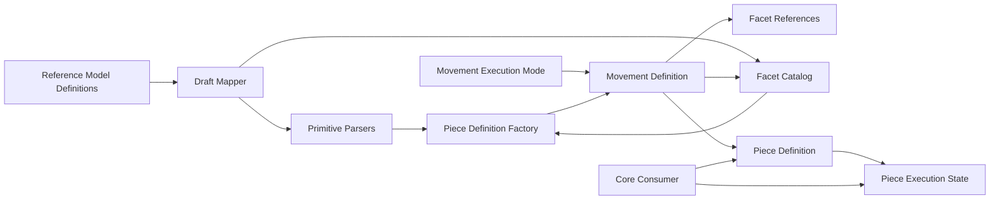

# 技術設計: references-takt-always-valid

## 概要
本設計の目的は、`references/takt` のワークフロー領域ドメイン（Piece / Movement / Rule / Output Contract / Part / 実行状態）を、`modules/core` に移植するための技術仕様を定義することである。移植先では、外部入力を直接ドメインへ流さず、ドメインプリミティブを介した構築時検証で無効状態を排除する。

対象ユーザーは、ZAIN のワークフロー実装者と品質保証担当者である。設計時点で「生成できるオブジェクトは常に有効」を満たし、実行時の追加バリデーションに依存しない挙動を狙う。

影響範囲は `modules/core` の新規 `zain.core.takt` ドメイン型と対応テストであり、既存 `zain.core.mcp` 契約は変更しない。

## アーキテクチャ
### パターン
- **Domain Primitive + Always-Valid Aggregate**: 識別子・名称・条件式・遷移先を専用型に変換し、集約生成時に不変条件を確定する。
- **Immutable State Transition**: 実行状態更新は破壊的変更を禁止し、新しいインスタンスを返す。
- **Parse-at-Boundary**: 外部入力は境界コンポーネントで `parseXxx` により `Either` へ正規化し、ドメイン層内で例外駆動を使わない。

### 境界マップ

### 技術スタック
| レイヤー | 技術/バージョン | 役割 |
|---------|---------------|------|
| Domain | Scala 3.8.x | 集約・値オブジェクト・エラー型定義 |
| Validation Contract | Scala標準型（`Either`） | 失敗契約を型で返却 |
| Test | ScalaTest 3.2.19 | 要件ID単位の契約検証 |

### 推奨ファイル構成
| パス | 責務 |
|---|---|
| `modules/core/src/main/scala/zain/core/takt/primitives/` | `PieceName` などのドメインプリミティブ |
| `modules/core/src/main/scala/zain/core/takt/movement/` | Movement/Rule/Part/TeamLeader の定義と生成 |
| `modules/core/src/main/scala/zain/core/takt/facet/` | Facet定義集合と参照整合性 |
| `modules/core/src/main/scala/zain/core/takt/piece/` | Piece定義・実行状態・ドメインエラー種別 |
| `modules/core/src/test/scala/zain/core/takt/` | 要件トレーサビリティ対応テスト |

## コンポーネントとインターフェース
### サマリー
| コンポーネント | ドメイン/層 | 意図 | 要件カバレッジ |
|-------------|----------|------|-------------|
| `ReferenceModelInventory` | Domain | 移植対象と参照元ファイルの対応管理 | 1.1, 1.2, 1.3 |
| `TaktPrimitiveParsers` | Domain | ドメインプリミティブの構築時検証 | 2.1, 2.2, 2.3, 2.4 |
| `FacetCategory` | Domain | Facet種別を列挙型で表現し参照カテゴリを明示 | 4.5, 4.6, 4.7 |
| `FacetReferenceEntry` | Domain | Facet参照をカテゴリ付きエントリへ正規化 | 4.5, 4.6, 4.7 |
| `FacetReferences` | Domain | movement facet指定を参照検証専用モデルへ正規化 | 4.5, 4.6, 4.7 |
| `FacetCatalog` | Domain | Facet定義と参照整合性を `parse` 契約で保証 | 4.5, 4.6, 4.7 |
| `MovementExecutionMode` | Domain | movement実行モードを単一値で表現 | 4.1, 4.2 |
| `TeamLeaderConfiguration` | Domain | team leader 設定（maxParts等）のAlways-Valid化 | 1.1, 4.1 |
| `PartDefinition` | Domain | 分割されたpart定義のドメイン表現 | 1.1, 7.1 |
| `MovementDefinition` | Domain | movement設定（実行モード・rule・facet参照）の整合性管理 | 3.1, 4.1, 4.2, 4.3, 4.4, 4.5, 4.6, 4.7 |
| `PieceDefinition` | Domain Aggregate | Piece全体の初期整合性保証 | 3.1, 3.2, 3.3, 3.4, 3.5, 3.6, 3.7, 3.8 |
| `PieceDefinitionFactory` | Domain Factory | 外部入力をAlways-ValidなPieceへ変換 | 3.x, 4.x, 6.1, 6.2, 6.3 |
| `PieceExecutionState` | Domain Aggregate | 実行状態と遷移の整合性保証 | 5.1, 5.2, 5.3, 5.4, 5.5, 7.3 |
| `PieceDefinitionError` | Domain | Piece生成/構成失敗を識別可能な型へ固定化 | 6.2, 6.3 |
| `PieceExecutionError` | Domain | 実行遷移失敗を識別可能な型へ固定化 | 5.5, 6.2 |

### `ReferenceModelInventory`
- 責務: 移植対象（Piece/Movement/Rule/Output Contract/Part/State）と参照元パスを追跡可能にする。
- 公開インターフェース:
  - `registerTarget(target: ReferenceModelTarget, sourcePaths: Vector[String]): Either[ReferenceModelInventoryError, ReferenceModelInventory]`
  - `registerExclusion(excludedName: String, reason: String): Either[ReferenceModelInventoryError, ReferenceModelInventory]`
  - `registeredTargets: Set[ReferenceModelTarget]`
- 契約: 各移植対象に1件以上の参照元ファイルを保持し、除外時は理由必須。

### `TaktPrimitiveParsers`
- 責務: 文字列/数値入力をドメイン固有型へ変換する。
- 公開インターフェース:
  - `parsePieceName(value: String): Either[TaktPrimitiveError, PieceName]`
  - `parseMovementIdentifier(value: String): Either[TaktPrimitiveError, MovementName]`
  - `parseRuleCondition(value: String): Either[TaktPrimitiveError, RuleCondition]`
  - `parseTransitionTarget(value: String): Either[TaktPrimitiveError, TransitionTarget]`
  - `parseMaxMovements(value: Int): Either[TaktPrimitiveError, MaxMovements]`
  - `parseIterationCount(value: Int): Either[TaktPrimitiveError, IterationCount]`
- 契約: 空文字拒否、1文字許可、生成後不変。

### `FacetCategory`
- 責務: Facet参照のカテゴリを列挙型で保持する。
- 公開インターフェース:
  - `Persona`
  - `Policy`
  - `Knowledge`
  - `Instruction`
  - `OutputContract`
- 契約: カテゴリは閉じた集合として定義し、文字列ベース判定を禁止する。

### `FacetReferenceEntry`
- 責務: 1つのFacet参照をカテゴリ付きで保持する。
- 公開インターフェース:
  - `of(category: FacetCategory, reference: FacetName): FacetReferenceEntry`
- 契約: `FacetCatalog` の照合入力は `FacetReferenceEntry` に正規化された値のみを扱う。

### `FacetReferences`
- 責務: `MovementFacets` の参照値を、`FacetCatalog` 検証専用の不変モデルへ変換する。
- 公開インターフェース:
  - `create(persona: Option[FacetName], policies: Vector[FacetName], knowledge: Vector[FacetName], instruction: Option[FacetName], outputContracts: Vector[FacetName]): FacetReferences`
  - `entries: Vector[FacetReferenceEntry]`
- 契約: フィールドは欠落を許容するが、`FacetCatalog` 検証の入力形を固定する。

### `FacetCatalog`
- 責務: Persona/Policy/Knowledge/Instruction/Output Contract の定義済み集合と参照妥当性を管理する。
- 公開インターフェース:
  - `create(personas: Vector[FacetName], policies: Vector[FacetName], knowledge: Vector[FacetName], instructions: Vector[FacetName], outputContracts: Vector[FacetName]): FacetCatalog`
  - `parseReferences(facets: FacetReferences): Either[PieceDefinitionError, FacetReferences]`
- 契約: `facets.entries` の各 `FacetReferenceEntry` をカテゴリごとの定義集合で照合し、未定義参照が1件でもあれば失敗する。成功時は検証済み `FacetReferences` を返す。

### `MovementExecutionMode`
- 責務: movement実行モードを単一値で保持し、排他制約を型で表現する。
- 公開インターフェース:
  - `Sequential`
  - `Parallel`
  - `Arpeggio`
  - `TeamLeader(configuration: TeamLeaderConfiguration)`
  - `resolve(hasParallel: Boolean, hasArpeggio: Boolean, teamLeader: Option[TeamLeaderConfiguration]): Either[PieceDefinitionError, MovementExecutionMode]`
- 契約: legacy入力で複数モードが同時指定された場合は `ConflictingExecutionModes` で失敗。

### `TeamLeaderConfiguration`
- 責務: `teamLeader` 設定をドメイン値として保持する。
- 公開インターフェース:
  - `create(maxParts: Int, timeoutMillis: Int): Either[PieceDefinitionError, TeamLeaderConfiguration]`
- 契約:
  - `maxParts` は1以上（参照実装互換で上限3）。
  - `timeoutMillis` は正の値。

### `PartDefinition`
- 責務: Team leader が生成する part の識別子・タイトル・指示を保持する。
- 公開インターフェース:
  - `create(id: String, title: String, instruction: String, timeoutMillis: Option[Int]): Either[PieceDefinitionError, PartDefinition]`
- 契約: `id`/`title`/`instruction` は空文字不可。

### `MovementDefinition`
- 責務: movement の排他設定・rule・facet参照を保持する。
- 公開インターフェース:
  - `createTopLevel(name: MovementName, rules: Vector[MovementRule], facets: MovementFacets, facetCatalog: FacetCatalog, executionMode: MovementExecutionMode): Either[PieceDefinitionError, MovementDefinition]`
  - `createNested(name: MovementName, rules: Vector[MovementRule], facets: MovementFacets, facetCatalog: FacetCatalog, executionMode: MovementExecutionMode): Either[PieceDefinitionError, MovementDefinition]`
  - `createTopLevel(... hasParallel: Boolean, hasArpeggio: Boolean, teamLeader: Option[TeamLeaderConfiguration])`（legacy互換）
  - `createNested(... hasParallel: Boolean, hasArpeggio: Boolean, teamLeader: Option[TeamLeaderConfiguration])`（legacy互換）
  - `rules: Seq[MovementRule]`
- 契約:
  - 実行モードは `MovementExecutionMode` の単一値。
  - `RuleCondition` は必須。
  - top-level movement rule は `next` 必須。
  - `MovementFacets` を `FacetReferences` に正規化して `facetCatalog.parseReferences` へ渡す。

### `PieceDefinition`
- 責務: Piece の初期整合性を保持する集約ルート。
- 公開インターフェース:
  - `movements: Seq[MovementDefinition]`
  - `initialMovement: MovementName`
  - `maxMovements: MaxMovements`
  - `movementNames: Set[MovementName]`
- 契約:
  - movement は1件以上。
  - `initialMovement` 未指定時は先頭。
  - 指定 `initialMovement` は一覧に存在。
  - movement名は一意。
  - `TransitionTarget.Movement` の遷移先は定義済みmovement名のみ許可。
  - `maxMovements` 未指定時は10、0以下は拒否。

### `PieceDefinitionFactory`
- 責務: 外部入力ドラフトをドメインモデルへ変換し、失敗時は識別可能なエラーを返す。
- 公開インターフェース:
  - `create(draft: PieceDraft): Either[PieceDefinitionError, PieceDefinition]`
- 契約:
  - 無効入力時は `Left` を返し、部分生成オブジェクトを公開しない。
  - movement名重複と未定義遷移先を生成時に拒否する。
  - 同一入力に対して同一エラー種別を返す。

### `PieceExecutionState`
- 責務: 実行状態遷移を保持する集約。
- 公開インターフェース:
  - `start(pieceDefinition: PieceDefinition): PieceExecutionState`
  - `transitionTo(target: TransitionTarget): Either[PieceExecutionError, PieceExecutionState]`
- 内部保持データ:
  - `allowedMovements: Set[MovementName]`（`start` で `PieceDefinition.movementNames` を取り込む）
- 契約:
  - 初期 `status=running`。
  - `iteration >= 0`。
  - `COMPLETE` で `completed`、`ABORT` で `aborted`。
  - `TransitionTarget.Movement(name)` は `allowedMovements` に存在しない場合拒否。
  - すべての更新操作は新インスタンスを返す。

### `PieceDefinitionError`
- 責務: Piece生成・構成時の失敗契約を型で固定化する。
- 公開インターフェース:
  - `EmptyMovements`, `DuplicateMovementName`, `InitialMovementNotFound`, `UndefinedTransitionTarget`, `NonPositiveMaxMovements`
  - `ConflictingExecutionModes`, `EmptyRuleCondition`, `EmptyRuleTransitionTarget`, `MissingTopLevelRuleTransitionTarget`
  - `EmptyPartId`, `EmptyPartTitle`, `EmptyPartInstruction`, `NonPositivePartTimeoutMillis`
  - `TeamLeaderMaxPartsOutOfRange`, `NonPositiveTeamLeaderTimeoutMillis`
  - `UndefinedPersonaReference`, `UndefinedPolicyReference`, `UndefinedKnowledgeReference`, `UndefinedInstructionReference`, `UndefinedOutputContractReference`
- 契約: 文字列メッセージではなくエラー種別で判定できる。

### `PieceExecutionError`
- 責務: 実行遷移時の失敗契約を型で固定化する。
- 公開インターフェース:
  - `UndefinedTransitionMovement`, `AlreadyFinished`
- 契約: 実行中以外の遷移と未定義遷移先を明示的に拒否できる。

## データモデル
### ドメインモデル
| 型 | 種別 | 主要属性 | 不変条件 |
|---|---|---|---|
| `PieceName` | 値オブジェクト | `value` | 空文字不可、1文字許可 |
| `MovementName` | 値オブジェクト | `value` | 空文字不可、1文字許可 |
| `RuleCondition` | 値オブジェクト | `value` | 空文字不可、1文字許可 |
| `TransitionTarget` | 値オブジェクト/ADT | `Complete` / `Abort` / `Movement(MovementName)` | 未定義movementは遷移拒否 |
| `FacetCategory` | 値オブジェクト/ADT | `Persona` / `Policy` / `Knowledge` / `Instruction` / `OutputContract` | カテゴリ集合は閉じている |
| `FacetReferenceEntry` | 値オブジェクト | `category`, `reference` | 参照はカテゴリ付きで照合される |
| `MaxMovements` | 値オブジェクト | `value` | 正の整数、既定10 |
| `IterationCount` | 値オブジェクト | `value` | 0以上 |
| `TeamLeaderConfiguration` | 値オブジェクト | `maxParts`, `timeoutMillis` | `maxParts` は1..3、`timeoutMillis` 正 |
| `PartDefinition` | エンティティ | `id`, `title`, `instruction`, `timeoutMillis` | `id/title/instruction` 空文字不可 |
| `MovementRule` | 値オブジェクト | `condition`, `next` | top-levelは`next`必須 |
| `MovementExecutionMode` | 値オブジェクト/ADT | `Sequential` / `Parallel` / `Arpeggio` / `TeamLeader` | 実行モードは常に単一 |
| `MovementDefinition` | エンティティ | `name`, `rules`, `facets`, `executionMode` | top-levelは遷移先必須、facet参照は定義済みのみ |
| `PieceDefinition` | 集約ルート | `name`, `movements`, `initialMovement`, `maxMovements` | movement非空・name一意・初期movement整合・遷移先整合 |
| `PieceExecutionState` | 集約ルート | `pieceName`, `currentMovement`, `iteration`, `status`, `allowedMovements` | `status` は `running/completed/aborted` |

### 論理データモデル
| 論理名 | 識別子 | 属性 | 整合性 |
|---|---|---|---|
| `PieceDefinitionModel` | `pieceName` | `initialMovement`, `maxMovements` | `initialMovement` は movement に存在 |
| `MovementDefinitionModel` | `(pieceName, movementName)` | `rules`, `executionMode`, `facets` | 同一piece内でname一意、モード単一 |
| `PartDefinitionModel` | `(pieceName, movementName, partId)` | `title`, `instruction`, `timeoutMillis` | `partId` 一意、文字列非空 |
| `PieceExecutionModel` | `(pieceName, executionId)` | `currentMovement`, `iteration`, `status`, `allowedMovements` | `iteration >= 0`、未定義遷移不可 |

## 要件トレーサビリティ
| 要件 | サマリー | コンポーネント | インターフェース |
|------|---------|-------------|---------------|
| 1.1 | 移植対象列挙（Piece/Movement/Rule/Output Contract/Part/State） | `ReferenceModelInventory`, `PartDefinition`, `TeamLeaderConfiguration` | `registerTarget`, `PartDefinition.create`, `TeamLeaderConfiguration.create` |
| 1.2 | 各対象へ参照元パス紐付け | `ReferenceModelInventory` | `registerTarget` |
| 1.3 | 除外理由の明示 | `ReferenceModelInventory` | `registerExclusion` |
| 2.1 | 識別子/名称/条件式/遷移先のプリミティブ化 | `TaktPrimitiveParsers` | 各 `parse` |
| 2.2 | 空文字拒否 | `TaktPrimitiveParsers` | 各 `parse` |
| 2.3 | 1文字許可 | `TaktPrimitiveParsers` | 各 `parse` |
| 2.4 | 生成済み値の不変性 | `TaktPrimitiveParsers` | 値オブジェクト定義 |
| 2.5 | `parseXxx` は `Either[Error, Value]` を返却 | `TaktPrimitiveParsers`, `FacetCatalog`, `MovementDefinition` | `parse*` |
| 3.1 | movement 1件以上で生成許可 | `PieceDefinitionFactory` | `create` |
| 3.2 | movement 0件拒否 | `PieceDefinitionFactory` | `create` |
| 3.3 | initialMovement 省略時は先頭採用 | `PieceDefinitionFactory` | `create` |
| 3.4 | 存在しない initialMovement 拒否 | `PieceDefinitionFactory` | `create` |
| 3.5 | maxMovements 省略時10 | `PieceDefinitionFactory` | `create` |
| 3.6 | maxMovements <= 0 拒否 | `PieceDefinitionFactory` | `create` |
| 3.7 | movement名重複拒否 | `PieceDefinitionFactory` | `create` |
| 3.8 | 未定義遷移先拒否 | `PieceDefinitionFactory` | `create` |
| 4.1 | executionMode は単一値 | `MovementExecutionMode`, `MovementDefinition` | `resolve`, `createTopLevel`, `createNested` |
| 4.2 | legacy複数指定拒否 | `MovementExecutionMode`, `MovementDefinitionInput` | `resolve`, `fromLegacy` |
| 4.3 | Rule条件空文字拒否 | `TaktPrimitiveParsers`, `MovementDefinition` | `parseRuleCondition`, `createTopLevel` |
| 4.4 | top-level rule の遷移先必須 | `MovementDefinition` | `createTopLevel` |
| 4.5 | Facet参照は定義済みのみ許可 | `FacetCatalog` | `parseReferences` |
| 4.6 | Facet参照整合は parse 契約で返却 | `FacetCatalog`, `FacetReferences` | `parseReferences` |
| 4.7 | Facet参照はカテゴリ付きで照合 | `FacetCategory`, `FacetReferenceEntry`, `FacetCatalog` | `entries`, `parseReferences` |
| 5.1 | 開始時 `running` | `PieceExecutionState` | `start` |
| 5.2 | iteration は0以上 | `PieceExecutionState` | `start`, `transitionTo` |
| 5.3 | COMPLETEで `completed` | `PieceExecutionState` | `transitionTo` |
| 5.4 | ABORTで `aborted` | `PieceExecutionState` | `transitionTo` |
| 5.5 | 未定義movement遷移拒否 | `PieceExecutionState` | `transitionTo`（`allowedMovements` 内検証） |
| 6.1 | 無効入力時はオブジェクト非生成 | `PieceDefinitionFactory` | `create: Either` |
| 6.2 | 失敗原因を識別可能に返却 | `PieceDefinitionError`, `PieceExecutionError` | エラーenum |
| 6.3 | 同一無効入力で同一失敗種別 | `PieceDefinitionFactory`, `TaktPrimitiveParsers` | 検証順序固定規約 |
| 7.1 | 要件1〜6に対応したテスト提供 | `PieceDomainContractSuite` | 要件ID対応ケース群 |
| 7.2 | 境界値（空/1文字/0件/1件/未定義参照）網羅 | `PieceDomainContractSuite` | 境界値ケース群 |
| 7.3 | 状態変更は新インスタンス返却 | `PieceDefinition`, `PieceExecutionState` | 更新メソッド群 |

## エラー処理戦略
- すべての生成・遷移失敗は `Either` で返し、例外は契約外とする。
- エラーは `PieceDefinitionError` / `PieceExecutionError` へ分類し、要件判定はエラー種別で行う。
- 同一入力で同一失敗種別を返すため、parse順序を以下で固定する。
  1. プリミティブ妥当性（空文字/数値範囲）
  2. 構造妥当性（非空、相互排他、必須遷移先）
  3. 参照妥当性（facet / movement の存在）

## テスト戦略
### 要件別テストマトリクス
| テストID | 対応要件 | シナリオ | 期待結果 |
|---|---|---|---|
| `REQ1_TARGET_INVENTORY` | 1.1, 1.2 | 移植対象登録時に Piece/Movement/Rule/Output Contract/Part/State を列挙し参照元パスを保持 | 全対象が登録済み、各対象にパス1件以上 |
| `REQ1_EXCLUSION_REASON` | 1.3 | 除外対象を登録 | 理由未設定は失敗、理由付きは成功 |
| `REQ2_PRIMITIVE_EMPTY` | 2.2 | 空文字で各プリミティブを生成 | すべて `Left(EmptyValue)` |
| `REQ2_PRIMITIVE_ONE_CHAR` | 2.3 | 1文字で各プリミティブを生成 | すべて成功 |
| `REQ2_PARSE_CONTRACT` | 2.5 | parse API の戻り型を検証 | すべて `Either[Error, Value]` |
| `REQ3_PIECE_DEFAULTS` | 3.1, 3.3, 3.5 | movement 1件、initial/max省略で生成 | initial=先頭、max=10 |
| `REQ3_PIECE_REJECTIONS` | 3.2, 3.4, 3.6, 3.7, 3.8 | movement空、未知initial、max<=0、重複名、未定義遷移先 | 対応エラーで拒否 |
| `REQ4_MOVEMENT_EXCLUSIVITY` | 4.1, 4.2 | executionMode単一性とlegacy複数指定を検証 | 2個以上指定で拒否 |
| `REQ4_RULE_CONSTRAINT` | 4.3, 4.4 | 空condition / top-level next欠落 | 生成拒否 |
| `REQ4_FACET_REFERENCE` | 4.5, 4.6, 4.7 | 未定義Facet参照 | `Undefined*Reference` 系で拒否 |
| `REQ5_EXECUTION_TRANSITION` | 5.1, 5.2, 5.3, 5.4, 5.5 | start後にCOMPLETE/ABORT/未定義movementへ遷移 | completed/aborted/拒否 |
| `REQ6_FAILURE_CONTRACT` | 6.1, 6.2 | 無効入力で生成 | オブジェクト非生成、識別可能エラー |
| `REQ6_STABLE_ERROR_KIND` | 6.3 | 同一無効入力を複数回投入 | 同一エラー種別が返る |
| `REQ7_IMMUTABLE_UPDATE` | 7.3 | 状態更新前後の同一参照比較 | 更新は別インスタンス |

### ユニット
- ドメインプリミティブ生成（空文字拒否、1文字許可、数値境界）
- `TeamLeaderConfiguration` と `PartDefinition` の生成制約
- `MovementDefinition` の排他制約・rule制約
- `FacetCatalog` の参照整合性
- `PieceExecutionState` の遷移制約と不変更新

### 統合
- `PieceDraft` から `PieceDefinition` への一括生成
- `initialMovement` / `maxMovements` の既定値適用
- team leader 設定を含む movement 構成生成
- Facet参照付き movement 生成時の定義整合
- エラー種別の再現性確認（同一入力反復）

### E2E
- Piece生成 → 実行開始 → 遷移完了までの契約通し検証
- 境界値セット（空文字、1文字、0件、1件、未定義参照）の回帰実行
